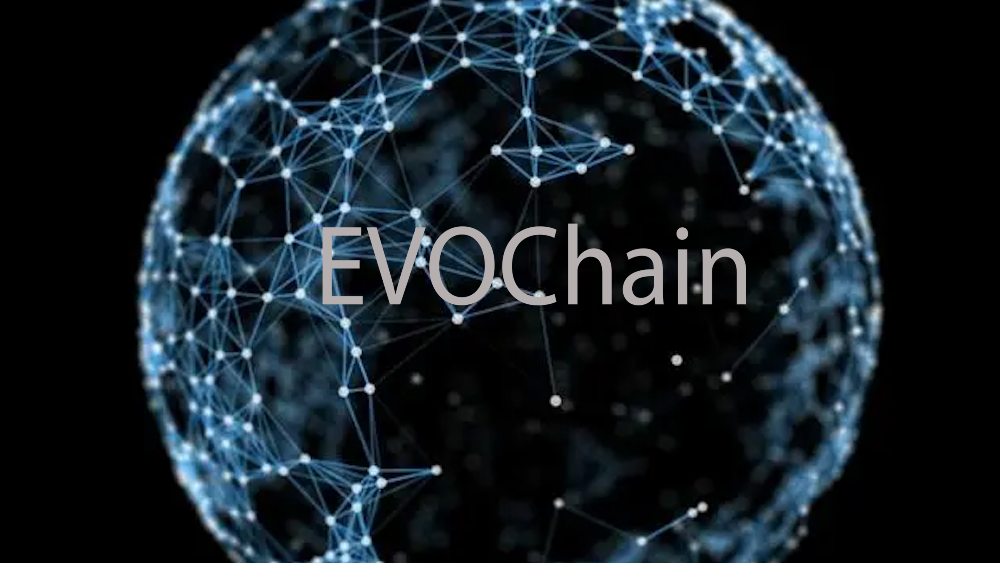
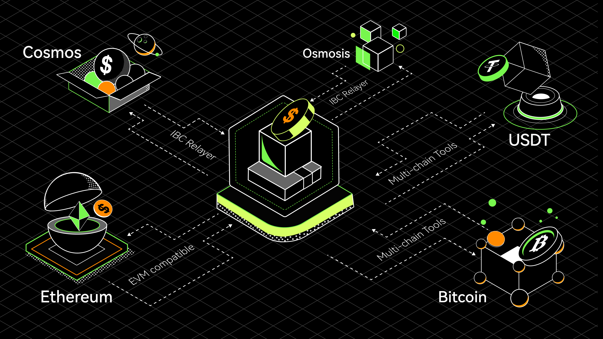

# Introduction

## What is EVOChain？

EVOChain is a set of open-source blockchain projects developed by EVOblock, aiming to promote the development of large-scale commercial applications based on blockchain technology. It gives each participating node the same rights, allowing users to launch a variety of decentralized applications smoothly, issue their digital assets, create their own digital asset trading pairs, and trade freely. The utilisation of cross-chain technology principles is essential to allow those features to be used by anyone. Through the cross-chain module, the value interconnectivity and user interconnectivity, interconnectivity of blockchain can be realized simply and efficiently, so that we can co-construct the ecosystem and the value-added system.

## The EVO

Do you have EVO tokens? With EVO, you have the unique ability to contribute to the security and governance of the EVO. Delegate your EVO to one or more of the 100 validators on the EVO blockchain to earn more EVO through Proof-of-Stake. You can also vote with your EVO to influence the future of the EVO through on-chain governance proposals.

Learn more about [being a delegator](./delegators/delegators-faq.md).

## EVO Explorer

The EVO block explorer allows you to search, view and analyze EVO data—like blocks, transactions, validators as well as other key information.

* [EVOBlock](https://www.evoblock.com)

## EVO CLI

`evochaincli` is a command-line interface that lets you interact with the EVO. `evochaincli` is the only tool that supports 100% of the EVO features, including accounts, transfers, delegation, and governance. Learn more about evochaincli with the [delegator's CLI guide](./delegators/delegators-guide-cli.html).

## Running a full-node on the EVO Testnet

In order to run a full-node on the EVO testnet, you must first [install `evochaind`](./getting-start/install-evo.html). Then, follow [the guide](./getting-start/install-evo.html).

If you would like to run a validator node, follow the [validator setup guide](./validators/validators-guide-cli.html).

## Join the Community

Have questions, comments, or ideas? Feel free to participate and to become part of the EVO community through one of the following channels.

## Version

The version of the program relating to this documentation is: 1.0

